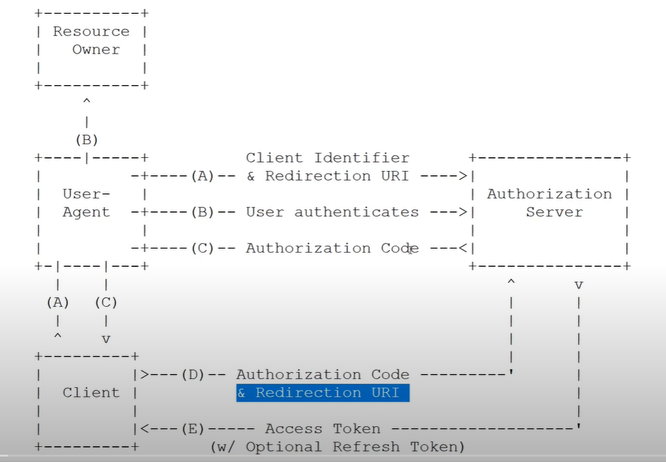
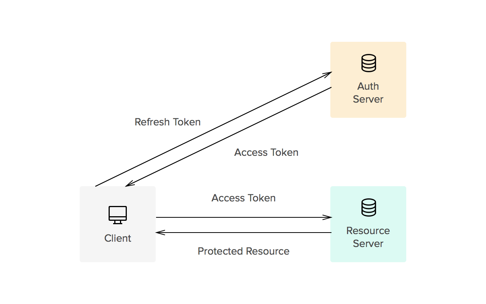
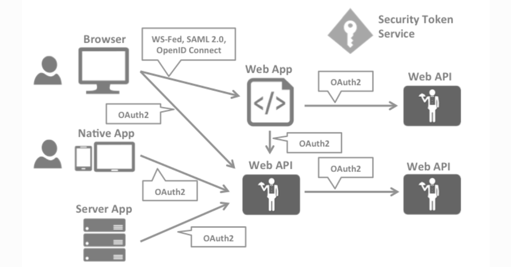
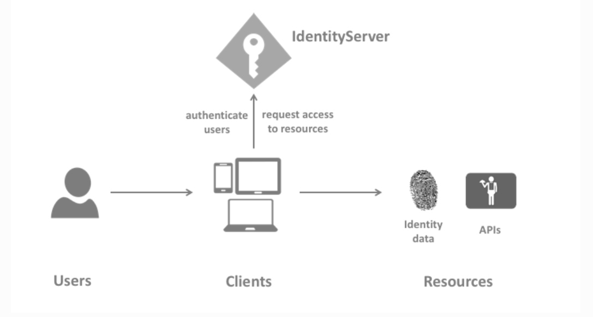

# AspcoreAuth

<ul>
	<li>
		There is a mail kit nuget package <b>NetCore.MailKit</b> to send email in asp.net core project
	</li>
</ul> 
<h3>Steps involved in implement email confirmation when registering</h3>
<ol>
	<li>Install NetCore.mailKit nuget package</li>
	<li>In Startup.cs, in services.AddIdentity add config.SignIn.RequiredConfirmedEmail = true;</li>
	<li>
		
		Add <b>Email</b> block in <b>appSetting.json</b>  
		<pre>
			"Email": {
			"Server": "127.0.0.1",
			"Port": 25,
			"SenderName": "Newman",
			"SenderEmail" :  "Test@test.com"
			}
		</pre>
		In startup.cs we need to register Mailkit 
		<pre>
			var mailKitOptions = _config.GetSection("Email").Get<MailKitOptions>();
            services.AddMailKit(config => config.UseMailKit(mailKitOptions));
		</pre>
	</li>
	<li>
		Inject IEmailService where we send email in the registration user
	</li>
	<li>
		Using IEmailservice generate the code and send email
		<pre>
			var code = await _userManager.GenerateEmailConfirmationTokenAsync(user);
			var link = Url.Action(nameof(VerifyEmail),"Home",new {userId=user.Id, code }, Request.Scheme, Request.Host.ToString());
			await _emailService.SendAsync("test@test.com", "Email Verify", link);
			return RedirectToAction("EmailVerification");
		</pre>
	</li>
	<li>
		Since we installed <b>PaperCut</b> email dev client, that will notify you a email received, you can click the link on it.
	</li>
	<li>
		Validate the code from the link cliked
		<pre>
			 var user =await _userManager.FindByIdAsync(userId);
            if (user == null)
            {
                return BadRequest();
            }
            var result = await _userManager.ConfirmEmailAsync(user, code);
            if (result.Succeeded)
            {
                return View();
            }
            else
            {
                return BadRequest();
            }
		</pre>
	</li>
</ol>

	<h3>Authorization</h3>
	In .Net core autorization the default authorization policy is the user should get authenticated  we override our own default authorization plolicy.  
	
	<pre>
	        services.AddAuthorization(config =&gt;
            {
                var defaultAuthBuilder = new AuthorizationPolicyBuilder();
                var defaultAuthPolicy = defaultAuthBuilder
                .RequireAuthenticatedUser()
                .RequireClaim(ClaimTypes.DateOfBirth)
                .Build();

                config.DefaultPolicy = defaultAuthPolicy;
            });
	</pre>
	if you don't have claim of type DataBirth then we'll get access denied page.
	this is what defaultly happen.
	 
	We can directly use authorization using attribute like
	<b>[Authorize(Role="Admin")]</b> or
	<b>[Authorize(Policy="SomePolicy")]  //It may be built-in policy or custom policy
	or Using <b>IAuthorizationService</b>  
	we can implement authorization.
	 

	<ul>
		<li>
			<h3>IAuthorizationService</h3> 
			If you want to authorize a user inbetween a proess, that means if you want to implement authorization check middle of the process,  
			we can inject IAuthorizationService and using it to check the authorization.
			ex.:
			<pre>
				 public async Task<IActionResult> DoStuff() {
					//Do any stuff here
					var builder = new AuthorizationPolicyBuilder("Schema");
					var customPolicy = builder.RequireClaim("Hello").Build();
					var authResult = await _authorizationService.AuthorizeAsync(User, customPolicy);
					if (authResult.Succeeded)
					{ 
						//Authorization success
					}
					//await _authorizationService.AuthorizeAsync(User, "Claim.DoB");  //  Constructor Injection
					return View("Index");
				}
			</pre> 
			We can alos doign the same in the MVC View. 
			We can also inject IAuthorizationService in function level 
			ex.:
			<pre>
			        public async Task<IActionResult> DoStuff_FuncInject([FromServices] IAuthorizationService authService)
					{
						//Do any stuff here
						var builder = new AuthorizationPolicyBuilder("Schema");
						var customPolicy = builder.RequireClaim("Hello").Build();
						var authResult = await authService.AuthorizeAsync(User, customPolicy);
						if (authResult.Succeeded)
						{
							return View("Index");
						}
						//await _authorizationService.AuthorizeAsync(User, "Claim.DoB");
						return View("Index");
					}
			</pre>
		</li>
		<li>
			<h3>Global Authorization filter</h3> 
			When we create a filter in the startup.cs or customfilter, we want to use it as attribute in the controller function. But what if I want to appliy a filter for all controller function globally?, for that we have global policy... 
			<pre>
				//This is global filter, will added to all controller methods. If you want to bypass need to add [AllowAnonymous] atribute
				//This you can directly write in startup.cs or use filters.
				services.AddControllersWithViews(config =>
				{
					var defaultAuthBuilder = new AuthorizationPolicyBuilder();
					var defaultAuthPolicy = defaultAuthBuilder
					//If I add Database claim, it will thro Access denied even in Index page
					//.RequireClaim(ClaimTypes.DateOfBirth)
					.RequireAuthenticatedUser()
					.Build();
					config.Filters.Add(new AuthorizeFilter(defaultAuthPolicy));
				});
			</pre>
		</li>
		<li>
			<h3>OperationAuthorizationRequirement</h3> 
			it is also kind of Authorization Requirement but this we can use as a check point in any opertion for checking users permission
			<pre>
				public class OperationController : Controller
				{
					private readonly  IAuthorizationService _authorizationService;
					public OperationController(IAuthorizationService authorizationService)
					{
						_authorizationService = authorizationService;
					}
					public async Task<IActionResult> Open()
					{
						var requirement = new OperationAuthorizationRequirement
						{
							Name = CookieJarOperations.ComeNear
						};
						CookiJarResource resource = new CookiJarResource { Name = "Open" };
						//await _authorizationService.AuthorizeAsync(User, null, requirement);
						await _authorizationService.AuthorizeAsync(User, resource, requirement);
						//Second parameter(resource) is optional but we can pass if any and need to specify this in the AuthorizationHandler
						return View();
					}
				}
				public class CookieJarAuthorizationHandler : AuthorizationHandler<OperationAuthorizationRequirement, CookiJarResource>
				{
					protected override Task HandleRequirementAsync(AuthorizationHandlerContext context, 
						OperationAuthorizationRequirement requirement, CookiJarResource resource)
					{
						//You can check resource for anyrequirement if you have
						if (requirement.Name == CookieJarOperations.Look)
						{
							if (context.User.Identity.IsAuthenticated)
							{
								context.Succeed(requirement);
							}
						}
						else if (requirement.Name == CookieJarOperations.ComeNear)
						{
							if (context.User.HasClaim("Friend","GoodFriend"))
							{
								context.Succeed(requirement);
							}
						}
						else if (requirement.Name == CookieJarOperations.Look)
						{ 
						}
						return Task.CompletedTask;
					}
				}
				public static class CookieJarOperations {
					public static string Open = "Open";
					public static string TakeCookie = "TakeCookie";
					public static string ComeNear = "ComeNear";
					public static string Look = "Look";
				}
				public class CookiJarResource
				{
					public string Name { get; set; }
				}
			</pre>
		</li>
		<li>
			<h3>Claims Tranformation</h3> 
			We have <b>IclaimsTransformation</b>, which will be call everty time a user get authenticated. So in this stage we can add any claims for that user. It is importent that claims added in IClaimsTransformation will be scope basis once the user outof scope it will be wipe out, that means for the next request I'll be created again.
			<pre>
			 public class ClaimsTransformation : IClaimsTransformation
				{
					public Task<ClaimsPrincipal> TransformAsync(ClaimsPrincipal principal)
					{
						var hasFriendClaim = principal.Claims.Any(x => x.Type == "Friend");
						if (!hasFriendClaim)
						{
							((ClaimsIdentity)principal.Identity).AddClaim(new Claim("Friend", "Bad"));
						}
						return Task.FromResult(principal);
					}    
				}
			</pre>
			We need to register it in the startup.cs configureServices.
		</li>
		<li>
			<h3>Authorization Polcy Provider</h3> 
			<h2>Learn it from diffeent source???</h2>
		</li>
		<li>
			<h3>Authorizing Razor pages</h3>
			Not like controller we cannot add authorize attribute to razor pages. so we need to configure aithorization to razor pages in startup.cs 
			<pre>
				//in configureServices
				services.AddRazorPages()
                .AddRazorPagesOptions(config => {
                    config.Conventions.AuthorizePage("/Razor/Secured");  //this is a folder route (Pages/Razor/Secured.cshtml)
                });
				//in Configure, within app.UseEndpointes
				app.UseEndpoints(endpoints =>{
					endpoints.MapDefaultControllerRpute();  //Already there
					endpoints.MapRazorPages();
				}
			</pre> 
			Add <b>Pages</b> dirextory in the project root and then a child directory within Pages folder <b>Razor</b>. If you create any page names  
			Secured.cschtml razor page, and navigate to this page, if you are not authorized then we'll redirect to login page. 
			You can also configure for a policy for a razor pages, 
			<pre>
			//in configureServices
				services.AddRazorPages()
                .AddRazorPagesOptions(config => {
                    config.Conventions.AuthorizePage("/Razor/Secured");  //this is a folder route (Pages/Razor/Secured.cshtml)
					config.Conventions.AuthorizePage("/Razor/Policy","PolicyName");  //this is a folder route (Pages/Razor/Secured.cshtml)
                });
			</pre>
			If the policy satisfied then it'll be authorized. 
			We can't give each pages authorize in the startup.cs so we can authorize folder wise.
			<pre>
			//in configureServices
				services.AddRazorPages()
                .AddRazorPagesOptions(config => {
                    config.Conventions.AuthorizePage("/Razor/Secured");  //this is a folder route (Pages/Razor/Secured.cshtml)
					config.Conventions.AuthorizePage("/Razor/Policy","PolicyName");  //this is a folder route (Pages/Razor/Secured.cshtml)
					config.Conventions.AuthorizeFolder("/Razor/RazorSecure");
                });
			</pre>
			Now all the razor pages with <b>Razor/RazorSecure</b> are should be authorize. But let say one page within <b>Razor/RazorSecure</b>  
			shuld be Anonymouse then we can specify that in the startup razor authorize, like,
			<pre>
			//in configureServices
				services.AddRazorPages()
                .AddRazorPagesOptions(config => {
                    config.Conventions.AuthorizePage("/Razor/Secured");  //this is a folder route (Pages/Razor/Secured.cshtml)
					config.Conventions.AuthorizePage("/Razor/Policy","PolicyName");  //this is a folder route (Pages/Razor/Secured.cshtml)
					config.Conventions.AuthorizeFolder("/RazorSecure");
					config.Conventions.AllowAnonymousToPage("/RazorSecure/Anon");
                });
			</pre>
			here all the pages except anan.cshtml within Razor/RazorSecure should be authorized.
		</li>
	</ul>
	

		<h2><u>Bearer and Bearer Authorization</u></h2> 
		<h3>JWT Bearer:</h3> 
		<ul>
			<li>
				<pre>
					services.AddAuthentication("OAuth")
						.AddJwtBearer("OAuth", config => {
							var secretBytes = Encoding.UTF8.GetBytes(Constants.Secret);
							var key = new SymmetricSecurityKey(secretBytes);
							config.TokenValidationParameters = new TokenValidationParameters()
							{
								ValidIssuer = Constants.Issuer,
								ValidAudience = Constants.Audiance,
								IssuerSigningKey = key,
							};
					});
				</pre>
				this will check the token passes to the service. Token generation is as follows.
			</li>
			<li>
				<pre>
					var claims = new[] {
					new Claim(JwtRegisteredClaimNames.Sub, "some_id"),
					new Claim("granny", "cookie")
					};
					//Goto Definition of SigningCredentials and right click on SecurityKey and 
					//press F1 will take you to Microsoft help SecurityKey and we can grab one key from the
					// listed keys. 
					//1. Microsoft.IdentityModel.Tokens.AsymmetricsSecurityKey, 
					//2. Microsoft.IdentityModel.Tokens.JsonWebKey
					//3. Microsfot.IdentityModel.Tokens.SymmetricSecurityKey
					var secretBytes = Encoding.UTF8.GetBytes(Constants.Secret);
					var key = new SymmetricSecurityKey(secretBytes);
					var algorithm = SecurityAlgorithms.HmacSha256;
					var signingCredentials = new SigningCredentials(key, algorithm);
					var token = new JwtSecurityToken(
							Constants.Issuer, 
							Constants.Audiance,
							claims,
							notBefore : DateTime.Now,
							expires : DateTime.Now.AddHours(1),
							signingCredentials
						);
					var toekJson = new JwtSecurityTokenHandler().WriteToken(token);
					return Ok(new { accessToken = toekJson });
				</pre>
				Generated token has three part, we can see those party by visting <b>jwt.io</b> and pasting the generated token. 
				<ol>
					<li>Header - has alorithm used and type of token</li>
					<li>Body - Has actual data we pass, that included all claims and issuer, audience, expire and not before</li>
					<li>Signature - This is generated using the combination of <b>Header</b> and <b>Body</b>. If someone change anything in the token then signature will not match with the body so authentication will be failed.</li>
				</ol>
				each part separated by fullstop.
			</li>
			<li>
				When you call the services you have to specify <b>Authorization = "beaerer [TokenHere]"</b> in the request header. OR you can pass it along the Url but for that we need to accept the token from the url and set it to the context, as below,
				<pre>
					services.AddAuthentication("OAuth")
						.AddJwtBearer("OAuth", config => {
							var secretBytes = Encoding.UTF8.GetBytes(Constants.Secret);
							var key = new SymmetricSecurityKey(secretBytes);
							//----------------------------------------------------------------------------------
							//If we want to pass Bearer token in url we can validate the token here
							//using JwtBeaererEvents. If yo want to pass it as header you don't need these block here
							config.Events = new JwtBearerEvents()
							{
								OnMessageReceived = context => {
									if (context.Request.Query.ContainsKey("access_token")) {
										context.Token = context.Request.Query["access_token"];
									}
									return Task.CompletedTask;
								}
							};
							//----------------------------------------------------------------------------------
							config.TokenValidationParameters = new TokenValidationParameters()
							{
								ValidIssuer = Constants.Issuer,
								ValidAudience = Constants.Audiance,
								IssuerSigningKey = key,
							};
						});
				</pre>
				now you can call <b>https://localhost:2323/home/security?access_token=[accesstoekn]</b>
			</li>
			<li>
				We can also programatically decode the token we send to the service.
				<pre>
				        public IActionResult Decode(string part)
						{
							//Here we have to give part of the Jwttoken not full
							var bytes = Convert.FromBase64String(part);
							return Ok(Encoding.UTF8.GetString(bytes));
						}
				</pre>
			</li>
			<li>
</li>
			<li>
				<h3>Creating Client and configure the server we created as Authentication Server</h3>
				 
				<pre>
					 services.AddAuthentication(config => {
						//we check the cookie to confirm that we are authenticated
						config.DefaultAuthenticateScheme = "ClientCookie";
						//When we sign in we will deal out a cookie
						config.DefaultSignInScheme = "ClientCookie";
						//Use this to check if we are allowed to do something
						config.DefaultChallengeScheme = "OurServer";
					})
						.AddCookie("ClientCookie")
						.AddOAuth("OurServer",config => {
							config.ClientId = "client_id";
							config.ClientSecret = "client_Secret";
							config.CallbackPath = "/oauth/callback";
							config.AuthorizationEndpoint = "https://localhost:44382/oauth/authorize";
							config.TokenEndpoint = "https://localhost:44382/oauth/token";
						});
				</pre>
			</li>
			<li>
				Now, when you browse any pages from client application it will be redirect to <b>servers oauth/authorize</b> page with some parameters.  Thos parameters are
					<ol>
						<li>client_id</li>
						<li>scope</li>
						<li>response_type</li>
						<li>redirect_uri</li>
						<li>state</li>
					</ol>
					  We need to pass back some parameter to the client and between get and post method, So we need to define these paramerter in servers <b>oauth/authorize</b> method. 
					Here We create a view for Login and send the a <b>Code</b> back to the client
			</li>
			<li>
				Now the client request for Token end point here we can retrive user information using the code that client passes and build all the cliams  
				and generate access token for the user and pass it to the client as Json response.
				<b>Server side coding</b>
				<pre>
				[HttpGet]
				public IActionResult Authorize(
					string response_type, //Authorization flow type
					string client_id,  //Client id
					string redirect_uri, // Client uri where user try to browse
					string scope, //what information I want ex. email, phone, grandma cookie...
					string state // randon string generted to confirm that we are going back to the same client
					)
				{
					var query = new QueryBuilder();
					query.Add("redirectUri", redirect_uri);
					query.Add("state", state);
					return View(model: query.ToString()); //?a=foo&b=bar format
				}
				[HttpPost]
				public IActionResult Authorize(string userName, string redirecturi, string state)
				{
					//We need some parameter for Authorization request from Get method so we pass it to this method too.
					//This methd should redirect to client with Code and state
					var code = "DJDKJKDJKJKJDJDKJ";
					var query = new QueryBuilder();
					query.Add("code", code);
					query.Add("state", state);
					return Redirect($"{redirecturi}{query.ToString()}");
				}
				public async Task<IActionResult> Token(
					string grant_type,  //flow of access_token request 
					string code, //Confirmation of the authentication process
					string redirect_uri, 
					string client_id)
				{
					//this method should return Json response that contain the following
					//"access_token, token_type, expire_in, refresh_token, example_parameter"
					//Some mechanism for validating the code, usualy save the code in database and validate it.
					var claims = new[] {
						new Claim(JwtRegisteredClaimNames.Sub, "some_id"),
						new Claim("granny", "cookie")
					};
					//Goto Definition of SigningCredentials and right click on SecurityKey and 
					//press F1 will take you to Microsoft help SecurityKey and we can grab one key from the
					// listed keys. 
					//1. Microsoft.IdentityModel.Tokens.AsymmetricsSecurityKey, 
					//2. Microsoft.IdentityModel.Tokens.JsonWebKey
					//3. Microsfot.IdentityModel.Tokens.SymmetricSecurityKey
					var secretBytes = Encoding.UTF8.GetBytes(Constants.Secret);
					var key = new SymmetricSecurityKey(secretBytes);
					var algorithm = SecurityAlgorithms.HmacSha256;
					var signingCredentials = new SigningCredentials(key, algorithm);
					var token = new JwtSecurityToken(
							Constants.Issuer,
							Constants.Audiance,
							claims,
							notBefore: DateTime.Now,
							expires: DateTime.Now.AddHours(1),
							signingCredentials
						);
					var access_token = new JwtSecurityTokenHandler().WriteToken(token);
					var responseObject = new
					{
						access_token,
						token_type="Bearer",
						raw_claim="oauthTutorial" //example parameter
					};
					var responseJson = JsonConvert.SerializeObject(responseObject);
					var responseBytes = Encoding.UTF8.GetBytes(responseJson);
					await Response.Body.WriteAsync(responseBytes,0, responseBytes.Length);
					return Redirect(redirect_uri);
				}
				</pre>
				But in the client side if the check the user claim, IT IS NOT THERE????????????.
				It is because we ned to explicitly tell the config to <b>Save the Token</b>
				<pre>
					services.AddAuthentication(config => {
					//we check the cookie to confirm that we are authenticated
					config.DefaultAuthenticateScheme = "ClientCookie";
					//When we sign in we will deal out a cookie
					config.DefaultSignInScheme = "ClientCookie";
					//Use this to check if we are allowed to do something
					config.DefaultChallengeScheme = "OurServer";
					})
					.AddCookie("ClientCookie")
					.AddOAuth("OurServer",config => {
						config.ClientId = "client_id";
						config.ClientSecret = "client_Secret";
						config.CallbackPath = "/oauth/callback";
						config.AuthorizationEndpoint = "https://localhost:44382/oauth/authorize";
						config.TokenEndpoint = "https://localhost:44382/oauth/token";
						config.SaveTokens = true;  // This is where we need to tell to save token
					});
				</pre>
			</li>
			<li>
				<b>One main thing is we are getting the access token that doesn't mean all the claim for that user are loaded in to the User context. That we need to load mannually if you need to use them in the client authorization, policy or Role</b>
				<pre>
					services.AddAuthentication(config => {
					//we check the cookie to confirm that we are authenticated
					config.DefaultAuthenticateScheme = "ClientCookie";
					//When we sign in we will deal out a cookie
					config.DefaultSignInScheme = "ClientCookie";
					//Use this to check if we are allowed to do something
					config.DefaultChallengeScheme = "OurServer";
					})
					.AddCookie("ClientCookie")
					.AddOAuth("OurServer",config => {
						config.ClientId = "client_id";
						config.ClientSecret = "client_Secret";
						config.CallbackPath = "/oauth/callback";
						config.AuthorizationEndpoint = "https://localhost:44382/oauth/authorize";
						config.TokenEndpoint = "https://localhost:44382/oauth/token";
						config.SaveTokens = true;
						config.Events = new OAuthEvents()
						{
							OnCreatingTicket = context => {
								var accessToken = context.AccessToken;
								var base64Payload = accessToken.Split('.')[1];  // Take the payload
								var bytes = Convert.FromBase64String(base64Payload);
								var jsonPayload = Encoding.UTF8.GetString(bytes);
								var claims = JsonConvert.DeserializeObject<Dictionary<string, string>>(jsonPayload);
								foreach (var claim in claims)
								{
									context.Identity.AddClaim(new Claim(claim.Key, claim.Value));
								}
								return Task.CompletedTask;
							}
						};
					});
				</pre>
				Note: If you have any predefined claim like Role it has name like http://..... so if you define such attribute and get Convert.FromBase64String throwing error. so if you have any such claim we can defind as string.
			</li>
			<li>
				<h3>Refesh Token</h3> 
				<ul>
					<li>
						  
					</li>
					<li>
						A refresh toekn is a special token that is used to generate additional Access tokens. This allow you to have short-lived Access token without having to collect user credential every time one expires.
					</li>
					<li>
						When we use javascript client, Access token is the one we pass to javascript client and get that access token with every request. We should not pass refresh token to the client, and with every response we should pass the access token to the client so incase of expirey of the access token we generate new access token using refresh token and client can get the new token that they can use from the next request.
					</li>
				</ul>
			</li>
		</ul>
	

	

		<h2><u>Identity Server</u></h2>
		 
		<ul>
			<li>
				Identity server is a framework that has Authentication and Authorization feature. Authentication using OpenID Connect and Authorization using OAuth2.
			</li>
			<li>
				It enabled the following feature in your application
				<ul>
					<li>
						<b>Authentication as Service</b>  
						Centralized login logic and workflow for all of your applications(Web, native, moble, services). Identity server is an official certified implementation of OpenID Conect
					</li>
					<li>
						<b>Signle Sign-On / Sign-Out</b> 
						Sgnle sign-on and sign-out over multiple application types
					</li>
					<li>
						<b>Access Control for APIs (Authorization)</b> 
						Issue access token for APIs for various types of clients, eg. Server to Server, Web applications, SPAs and native/mobile apps.
					</li>
					<li>
						<b>Federation Gateway</b> 
						Support for external Identity providers like Azure Active Directory, Google, Facebook etc.
					</li>
					<li>
						<b>Focus on Customization</b> 
						Many aspects of Identity Server can be customized to fit our needs.
					</li>
					<li>
						<b>Mature Open Source</b> 
						Identity Server is open source product. Uses the permissive Apache 2 license that allow building commercial products on top of it.
					</li>
					<li>
						<b>Free and Commercial support</b> 
						It is free and if you need any support on building or running, there are servral ways to get help.
					</li>
				</ul>
			</li>
			<li>
				Typical Token authentication system like follows 
				
			</li>
			<li>
				<b>What Identity Server does?</b>  
				
			</li>
			<li>
				Identity server is and OpenID Connect provider - it implements the OpenID Connect and OAuth 2.0 protocols  
				Following are the uses of IDP 
				<ul>
					<li>Protect you resources</li>
					<li>Authenticate users using a local account store or via an external identity provider</li>
					<li>Provides session management and single sign-on</li>
					<li>Manage and authenticate clients</li>
					<li>Issue Identity and access token to the client</li>
					<li>Validate token</li>
				</ul>
			</li>
			<li>
				Main entities of Identity servers are
				<ul>
					<li>
						<b>User</b> 
							A user is a human that is using a registered client to access resources.
					</li>
					<li>
						<b>Client</b> 
						Is a piece of software (Javascript app from browser, windows app, mobile app) that request token from Identity server - ether for authenticate a user(request an identity token) or for accessing a resource (requesting an access token) 
					</li>
					<li>
						<b>Resources</b> 
						Resources are something we want to protect with Identity server - either identity data of your users or APIs. 
						Every resources has unique name and clients use this name to specify to which resource they want to get access to. 
					</li>
					<li>
						<b>Identity Token</b> 
						Outcome of Authentication process, contains bare minimum and identifier for the user (subject claim) and information about how and when the user authenticated. It may contain additional identity datat too.
					</li>
					<li>
						<b>Access Token</b> 
						Outcome of Authorization process.Allow access to Api resources. Client request access token and forward then to API. Access token contain information about the client and the user. API uses this information to authorize access to their Data, Controller method...
					</li>					
				</ul>
			</li>
		</ul>
	

	

		<h2>Identity Server concept from Microsoft Webcast</h2> 
		

			Identity server 4 is an OpenID Connect and OAuth 2.0 framework for ASP.NET Core 2. 
			Its enables the following features in your application 
			<ul>
				<li>Authentication as Service : Centralized login logic - OpenID Connect</li>
				<li>Signle Sign-on : Single sign-on over multiple applications</li>
				<li>Access Control : Authorization - OAuth 2</li>
				<li>FederationGateway: Support for the external identity provider such as Google, Azure Active Directory</li>
			</ul>
		

		When we start building Identity server we can use In-Momory data such as TestUser, Client,Api Scope, IdentityResources and ApiResources
		<pre>
			services.AddIdentityServer()
			.AddSigningCredential("CN=sts") // this 
				.AddTestUsers()
				.AddInMemoryClients()
				.AddInMemoryApiResources()
				.AddInMemoryIdentityResources()
				.AddInMemoryApiScope()
		</pre>
		 
		Identity server issues Jwt Token which are securied in the sense of they are digitally signed. To do digital signature we need key material, We can use Self signed certificate for Key material that has Public and Private keys, using Makecert we can generate certificate and specify that in Identitserver configuration. let say we have generated a certificate call "sts", thats what we specify above in the Identity server DI specification as <b>.AddSigningCredential("CN=sts")</b>.
		In <b>Manage Users Certificates</b> we can view all certificates on the computer. 
		To create Certificate, from Powershell 
		<pre>
			New-SelfSignedCertificate -CertStoreLocation Cert:\LocalMachine\My -DnsName "mysite.local" -FriendlyName "MySiteCert" -NotAfter (Get-Date).AddYears(10)
		</pre>
		 
		GranTypes is the way how the client communicate with the identity server. there many grant types 
			<ul>
				<li>Implicit</li>
				<li>ClientCredential</li>
				<li>ImplicitAndClientCredentials</li>
				<li>Code</li>
				<li>CodeAndClientCredentials</li>
				<li>Hybrid</li>
				<li>HybridAndClientCredentials</li>
				<li>ResourceOwnerPassword</li>
				<li>ResourceOwnerPasswordAndClientCredentials</li>
				<li>DeviceFlow</li>
			</ul>
		 
		<b>What is Identity Resources?</b> 
			Identity resources are data like UserId, Name, email additionally OpenId (in Identity server OpenId means subject that is an unique to identity the user.An Identity resource has a Unique name  and you can assign arbitary claim type to it. these claims will then be included in the identity token for the user. Client will use <b> Scope</b> parameter to request access to an Identity resources, meaning we specify <b>AllowScopes</b> in client so identity server will pass those claim to the user.ex.
			<pre>
				AllowedScopes ={"openid", "email", "office"}
			</pre>
			os these claim are pass to the user from the client. 
			When you login using Ientity login after login it will ask your permission for profile and other claims. If you want to disable it since we are using our own identity server and clients we can disable it in the Identity client spcification
			<pre>
				new client{
					ClientId="mvc",
					ClientName="MVC Demo",
					RequireConsent = false,   //it will disable the consent
					AllowedGrantTypes= GrantTypes.Implicit,
					RedirectUris= {"http://localhost:25326/signin-odic"},
					RedirectUris= {"http://localhost:25326/signout-odic"},  //Signout from all the instance of the application for that user
					PostLogoutRedirectUris= {"http://localhost:25326/signout-callback-odic"},  //After logout redirect to client application
					AllowedScopes = {"openid", "office", "email", "office"}
				}
			</pre>
	

	

		<h2>Note:</h2> 
		

			Video 11, Client credential, during the call from Api2 to Api1 using client crdential, getting 401- UnAuthorized error. Need to implement as per channel9 video.  <b>Need to revisit</b>
		

	

